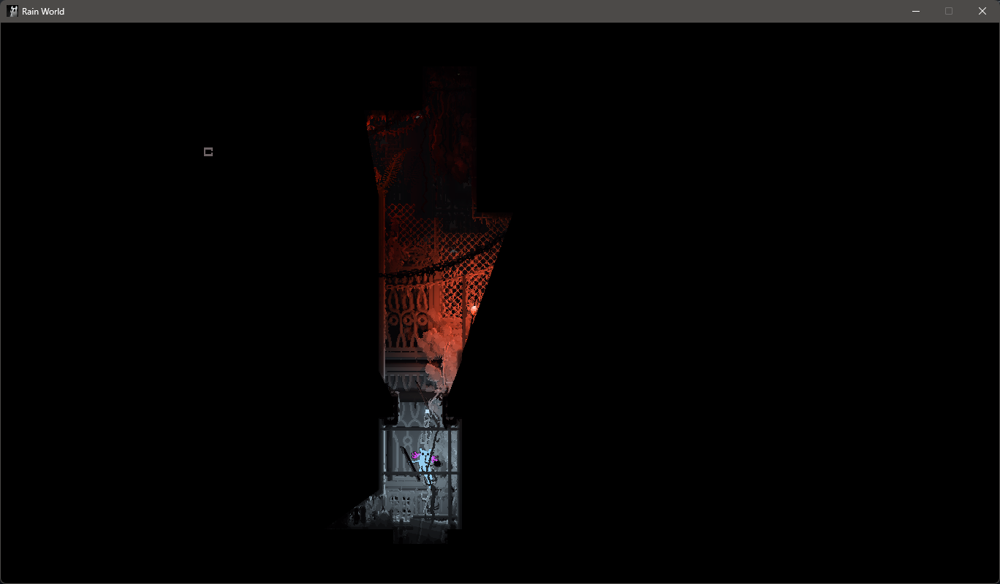

# Modifications in This Fork

## Visible Shelter Sprites in Classic Mode

This fork adds a crucial quality-of-life improvement for Classic mode players:

**Feature:** Shelter entrance sprites remain fully visible even outside your field of view, appearing as bright beacons in the darkness.

**Why?** Classic mode provides the most challenging line-of-sight experience with complete darkness outside FOV. This modification makes shelter entrances always visible, helping you locate safe havens without compromising the challenge of navigating through darkness.

**Compatibility:**
- Intended primarily for Classic mode
- Works in story mode and arena mode
- Supports both normal and ancient shelter sprites
- No performance impact

**Installation:** Same as base Line of Sight mod

## Credits

- Original mod by zombieseatflesh7
- Shelter visibility modification by SnekNOTSnake
